# 🛡️ Databricks SQL Interface - Trusted Web Application

**Enterprise-Grade Security with Long-Lived Sessions**

This is a **Trusted Web Application** that provides **maximum security** with **session-independent refresh tokens** - combining PKCE protection with Client Secret authentication for enterprise-grade OAuth security and seamless SQL query execution on Databricks.

## 🎯 Key Features

- **🔐 Maximum Security**: PKCE + Client Secret authentication
- **⏰ Long-lived Sessions**: Up to 90 days without re-authentication
- **🔄 Auto Token Refresh**: Seamless token renewal with 5-minute buffer
- **🛡️ Session Independence**: Refresh tokens survive Okta web logout
- **📊 SQL Interface**: Execute queries on any Databricks SQL warehouse
- **🎯 Dynamic Warehouse**: Choose warehouse ID at query time

## 🚀 Quick Start

### 1. **Create Okta Web Application**

1. Go to **Okta Admin Console**
2. **Applications → Create App Integration**
3. Choose **"OIDC - OpenID Connect"**
4. Choose **"Web Application"** (NOT Single-Page Application)
5. Configure:
   ```
   App Name: Databricks SQL Interface (Web App)
   Grant Types: ✅ Authorization Code, ✅ Refresh Token
   Sign-in redirect URIs: http://localhost:6000/callback
   Sign-out redirect URIs: http://localhost:6000/logout
   ```
6. **Save** and note the **Client ID** and **Client Secret**

### 2. **Setup Environment**

```bash
# Create virtual environment
python -m venv venv
source venv/bin/activate  # On Windows: venv\Scripts\activate

# Install dependencies
pip install -r requirements.txt

# Copy and configure environment
cp config.env.example config.env
# Edit config.env with your Okta Web App credentials
```

### 3. **Configure `config.env`**

```bash
# Okta Web Application Configuration
ISSUER_URL=https://your-okta-domain.okta.com/oauth2/your-auth-server-id
CLIENT_ID=your-web-app-client-id
CLIENT_SECRET=your-web-app-client-secret
REDIRECT_URI=http://localhost:6000/callback
OAUTH_SCOPE=openid profile email all-apis offline_access

# Databricks Configuration
DATABRICKS_SERVER_HOSTNAME=your-workspace.cloud.databricks.com
DATABRICKS_HTTP_PATH=/sql/1.0/warehouses/your-warehouse-id
```

### 4. **Run the Application**

```bash
python app.py
```

Visit: **http://localhost:6000**

## 🧪 Testing Session Independence

### **Test Scenario:**

1. **Start the Web App** (port 6000)
2. **Complete OAuth login**
3. **Execute some SQL queries** (works fine)
4. **Open new browser tab** → Go to your Okta domain → **Logout**
5. **Return to the Web App** → **Execute more SQL queries**
6. **Result**: ✅ **Queries still work!** (Refresh tokens are independent)

### **Compare with SPA:**

1. **Start the SPA** (port 5000) 
2. **Complete OAuth login**
3. **Execute some SQL queries** (works fine)
4. **Logout of Okta** in another tab
5. **Return to SPA** → **Try to execute queries**
6. **Result**: ❌ **Redirected to login** (Refresh tokens were invalidated)

## 📊 OAuth Flow Comparison

### **Web Application Flow (This App):**


### **SPA Flow (Comparison):**

```mermaid
sequenceDiagram
    participant User
    participant SPA
    participant Okta
    participant Databricks

    User->>SPA: Click "Start OAuth Flow"
    SPA->>Okta: Authorization Request (with PKCE)
    Okta->>User: Login Page
    User->>Okta: Enter Credentials
    Okta->>SPA: Authorization Code
    SPA->>Okta: Token Exchange (with code_verifier)
    Okta->>SPA: Access + Refresh Tokens (session-bound)
    SPA->>Databricks: Exchange for Workspace Token
    Databricks->>SPA: Workspace Token
    SPA->>User: SQL Interface Ready

    Note over SPA: Later... (after Okta web logout)
    SPA->>Okta: Refresh Token Request
    Okta->>SPA: ❌ invalid_grant (session expired)
    SPA->>User: ❌ Redirect to Login
```



## 🔧 Technical Implementation

### **Key Code Differences:**

**1. No PKCE Generation:**
```python
# SPA Version (complex):
code_verifier = base64.urlsafe_b64encode(secrets.token_bytes(32)).decode('utf-8').rstrip('=')
code_challenge = base64.urlsafe_b64encode(hashlib.sha256(code_verifier.encode()).digest()).decode('utf-8').rstrip('=')

# Web App Version (simple):
# No PKCE needed - uses client secret instead
```

**2. Token Exchange with Client Secret:**
```python
# Web App token exchange:
token_data = {
    'grant_type': 'authorization_code',
    'code': authorization_code,
    'redirect_uri': config.redirect_uri,
    'client_id': config.client_id,
    'client_secret': config.client_secret,  # Key difference!
    'scope': config.oauth_scope
}
```

**3. Refresh Token Request:**
```python
# Web App refresh (session-independent):
refresh_data = {
    'grant_type': 'refresh_token',
    'refresh_token': refresh_token,
    'client_id': config.client_id,
    'client_secret': config.client_secret,  # Required for Web Apps
    'scope': config.oauth_scope
}
```

## 🎉 Benefits

✅ **True Long-Lived Sessions**: Work for weeks without re-authentication  
✅ **Session Independence**: Survive Okta web logout  
✅ **Better UX**: No unexpected login prompts  
✅ **Production Ready**: Secure server-side implementation  
✅ **Automatic Refresh**: Tokens refresh every 55 minutes  

## 📁 Files

- `app.py` - Main Flask application (Web App flow)
- `config.env.example` - Configuration template
- `requirements.txt` - Python dependencies
- `templates/` - HTML templates
- `README.md` - This documentation

## 🔗 Related

- **SPA Version**: `../external-oauth-app/` (Port 5000)
- **OAuth Flow Comparison**: `../OAUTH-FLOWS-COMPARISON.md`
- **Token Refresh Guide**: `../external-oauth-app/TOKEN-REFRESH-GUIDE.md`

---

**🎯 Result**: Experience the difference of session-independent refresh tokens! 🚀
